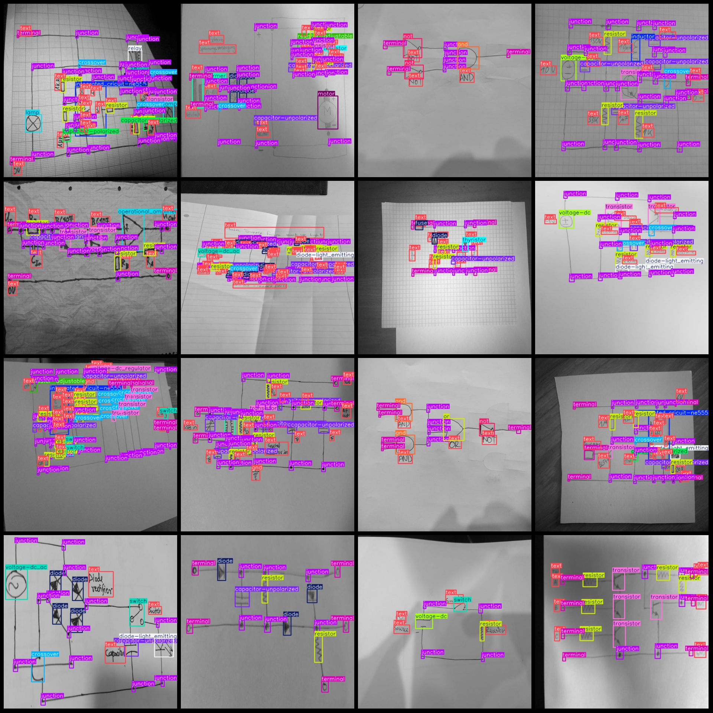
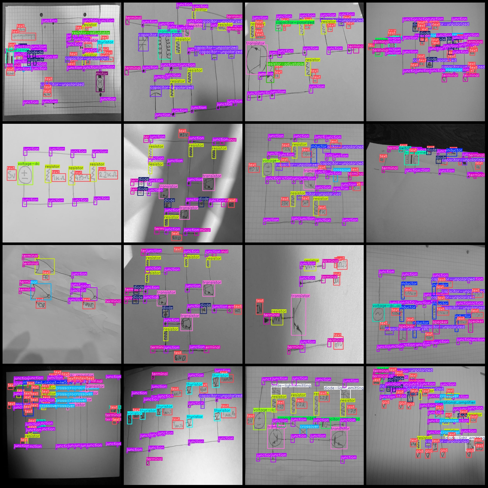

# Hand-drawn Circuit Diagram Detection Data Set for 1152 Categories (VOC+YOLO format)

Dataset format: Pascal VOC format + YOLO format (txt file without split path, only containing jpg images and corresponding VOC format xml files and yolo format txt files)
number of images: 1152  
The number of XML files is 1152.
annotation count: 1152  
annotationnumber of classes: 45  
annotation class names:["and", "antenna", "capacitor-polarized", "capacitor-unpolarized", "crossover", "diac", "diode", "diode-light_emitting", "fuse", "gnd", "inductor"]
"integrated_circuit","integrated_cricuit-ne555","junction","lamp","microphone","motor","nand","nor","not","operational_amplifier","optocoupler","or","probe-current","relay","resistor",
"resistor-adjustable","resistor-photo","schmitt_trigger","socket","speaker","switch","terminal","text","thyristor","transformer","transistor","transistor-photo","triac","varistor","voltage-dc",
"voltage-dc_ac","voltage-dc_regulator","vss","xor"]  
boxes per class:   
The total box count for AND gates is 104, with images of 72.
For antennas, the box count is 8, and the images are 8.
The box count for capacitor-polarized devices is 320 with images of 208.
Capacitor-unpolarized devices have a box count of 1500 with images of 724.
The box count for crossover devices is 1311, with images of 516.
Diacs have a box count of 8 with images of 8.
Distortion diodes have a box count of 1228 with images of 368.
Light-emitting diodes have a box count of 472 with images of 264.
Fuses have a box count of 20 with images of 20.
Ground has a box count of 768 with images of 260.
Inductors have a box count of 304 with images of 184.
Integrated circuits have a box count of 112 with images of 96.
An integrated circuit with NE555 timer has a box count of 144 with images of 128.
Junctions have a box count of 18221 with images of 1152.
Lamps have a box count of 88 with images of 72.
Microphones have a box count of 16 with images of 16.
Motors have a box count of 16 with images of 16.
NAND gates have a box count of 32 with images of 24.
OR gates have a box count of 40 with images of 40.
NOT gates have a box count of 152 with images of 72.
Operational amplifiers have a box count of 72 with images of 64.
Optocouplers have a box count of 56 with images of 56.
Or gates have a box count of 88 with images of 72.
Probe-current devices have a box count of 8 with images of 8.
Relays have a box count of 24 with images of 24.
Resistors have a box count of 3412 with images of 944.
Resistors adjustable with a box count of 160 with images of 152.
Resistors photosensitive have a box count of 20 with images of 20.
Schmitt triggers have a box count of 16 with images of 8.
Sockets have a box count of 40 with images of 40.
Speakers have a box count of 168 with images of 128.
Switches have a box count of 332 with images of 192.
Terminals have a box count of 2756 with images of 796.
Text has a box count of 14263 with images of 1112.
Thyristors have a box count of 352 with images of 104.
Transformers have a box count of 104 with images of 104.
Transistors have a box count of 952 with images of 528.
Transistor photosensitive have a box count of 8 with images of 8.
Triacs have a box count of 32 with images of 32.
Varistors have a box count of 152 with images of 72.
Voltage DC (direct current) has a box count of 384 with images of 344.
Voltage DC AC (direct current/alternating current) has a box count of 88 with images of 88.
Voltage DC regulators have a box count of 24 with images of 24.
VSS (negative supply/ground) has a box count of 116 with images of 40.
XOR gates have a box count of 48 with images of 32.
## Images

Here is a pay link on Stripe ( https://buy.stripe.com/3cs8yP7sY87d0vu9AB ). Please contact me lonlonago@foxmail.com after funding $89, and I will send you a complete data files , thank you!

